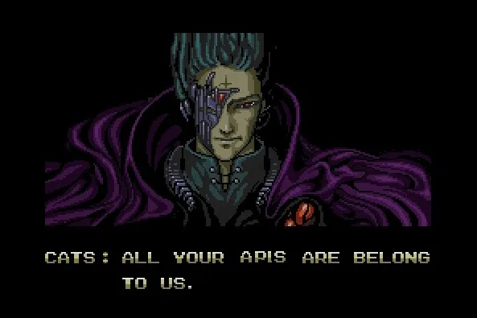

# OWASP API Top Ten 2023 - All Your API Vulnerabilities Are Belong to Us

Proliferation of Application Programming Interfaces (APIs) and associated API security risks is increasingly common. As as result, the [Open Web Application Security Project (OWASP)](https://owasp.org/), known for their venerable Top Ten Web Application Security Risks framework, introduced in 2019 a complementary Top Ten API Security Risks. In this blog post, we will discuss the newly released 2023 standards and what can be considered as common vulnerabilities in APIs. 

## Why the OWASP API Top Ten is Important

APIs are used in modern software as a means to allow different software components to communicate with one another. While APIs make building complex applications easier, they also create broader data security risks. These risks can manifest in different ways, from data breaches to denial-of-service attacks.

The OWASP API Top Ten API Security Risks framework is important for several reasons. First, it serves as a guide for developers who want to build secure APIs in an increasingly ‘Shift Left’ world, where the onus for security is increasingly on developers. By understanding the risks associated with APIs, developers can endeavor to mitigate those risks from the outset. Second, the OWASP API Top Ten is useful for security professionals who want to assess the security of existing APIs. By identifying common API security risks, security professionals can better evaluate the security posture of an organization's APIs and allow for effective prioritization of vulnerabilities based upon true risk.

## OWASP 2023 - What’s Changed

There are 4 major changes to the OWASP Top Ten API Security Risks:

1. OWASP combined Excessive Data Exposure and Mass Assignment and called it Broken Object Property Level Authorization, which makes a lot of sense as both Excessive Data Exposure and Mass Assignment vulnerabilties share this common root causality.
2. More focus has been put on resource consumption than in 2019 which was more focused on the rate or pace API were being consumed 
3. A new category of Unrestricted Access to Sensitive Business Flows was added because attacks are evolving and this category addresses these and covers those traditionally dealt with by rate limiting, i.e. scraping. 
4. OWASP has also created a category for emerging threats which they call Unsafe Consumption of APIs. This addresses attacks that don’t attack an API directly but through a integrated service, such as a 3rd party API.

## The 2023 OWASP Top Ten API Security Risks

| Category | Description |
| --- | --- |
| https://owasp.org/API-Security/editions/2023/en/0xa1-broken-object-level-authorization/ | APIs have a lot of endpoints that deal with object identifiers and this creates an extremely wide attack surface object level ACL issues. |
| https://owasp.org/API-Security/editions/2023/en/0xa2-broken-authentication/ | Incorrect implementation of authentication allows attackers to compromise auth tokens or exploit implementation flaws to assume another users identity. |
| https://owasp.org/API-Security/editions/2023/en/0xa3-broken-object-property-level-authorization/ | This is the category that combined Excessive Data Exposure and Mass Assignment from the OWASP 2019 API Top Ten. This is improper authorization (or a complete lack thereof) allows for the improper exposure or manipulation of data. |
| https://owasp.org/API-Security/editions/2023/en/0xa4-unrestricted-resource-consumption/ | Not only do APIs require compute and network resources, but often APIs are tied to other services that have a cost associated with usage. Attackers exploit this to create denial of service or increased costs. |
| https://owasp.org/API-Security/editions/2023/en/0xa5-broken-function-level-authorization/ | Complexity and lack of clear delineation of admin and regular function lead to flaws attackers use to gain access to data or administrative functions. |
| https://owasp.org/API-Security/editions/2023/en/0xa6-unrestricted-access-to-sensitive-business-flows/ | APIs exposing business flow (such as e-commerce) without understanding what unrestricted access could do to the business or reputation. |
| https://owasp.org/API-Security/editions/2023/en/0xa7-server-side-request-forgery/ | SSRF happens when an API calls a remote URL provided by the client without proper validation. |
| https://owasp.org/API-Security/editions/2023/en/0xa8-security-misconfiguration/ | Human error and not following security best practices leaves the door open to different attacks. |
| https://owasp.org/API-Security/editions/2023/en/0xa9-improper-inventory-management/ | APIs expose a plethora of endpoints, often with multiple versions exposed, and many aren’t documented or the documentation is wrong, allowing attackers to exploit. |
| https://owasp.org/API-Security/editions/2023/en/0xaa-unsafe-consumption-of-apis/ | Developers have a bias to more implicitly trust data received from machine versus human input, and therfore tend to have lessor controls over data received from 3rd party APIs leading to vulnerability via those APIs.  |

## Conclusion

The release of the OWASP API Top Ten 2023 standards is a significant milestone in burgeoning API security market, showing its evolving importance and maturity. With the increasing use of APIs in modern software development, it is becoming more crucial for developers and security professionals to understand the risks associated with APIs and take steps to mitigate them. The OWASP Top Ten API Security Risks serves as an essential guide for both developers and security professionals, providing a comprehensive list of common API security risks and vulnerabilities.

The changes made in the OWASP Top Ten API Security Risks for 2023 show a shift in focus towards resource consumption and access to sensitive business flows. By identifying these emerging threats, the OWASP Top Ten API Security Risks framework provides developers and security professionals with a better understanding of the risks associated with APIs. The standards also emphasize the importance of proper authentication, authorization, and inventory management, which are common areas where vulnerabilities can arise.

Overall, the OWASP Top Ten API Security Risks 2023 standards serve as a valuable resource for anyone involved in the development or security of APIs. By following these best practices, organizations can better protect themselves against the risks associated with APIs and ensure that their APIs are secure and reliable.

Keep an eye out here for deep dive posts on each of these categories.
